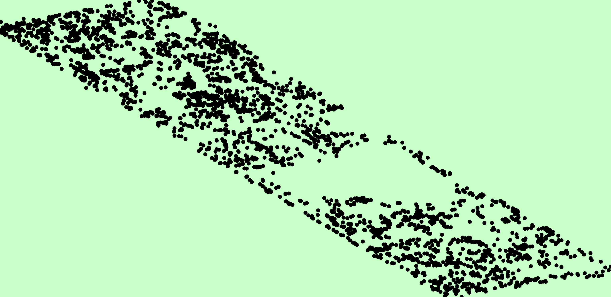
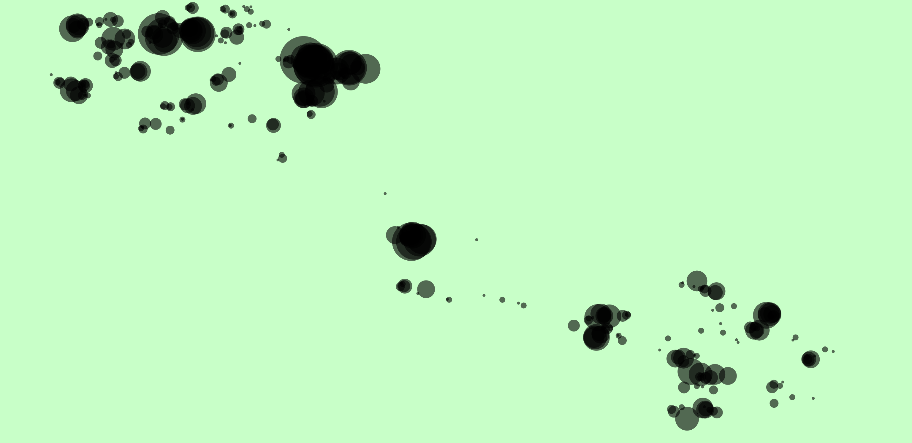
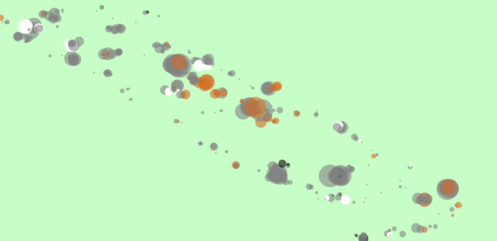
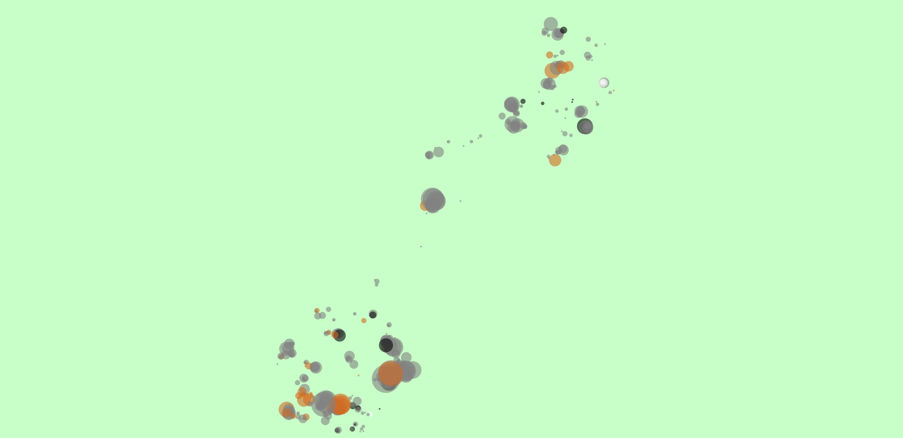
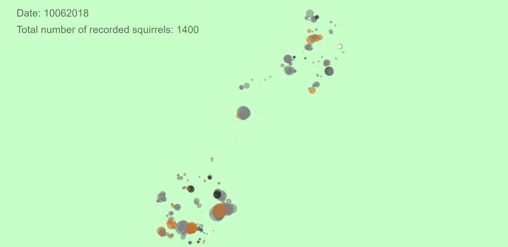

# HW05 Notes

This week's homework is to do a data visualization of a dataset. 

## Ideation
The dataset I chose is ["2018 Central Park Squirrel Census - Squirrel Data"](https://data.cityofnewyork.us/Environment/2018-Central-Park-Squirrel-Census-Squirrel-Data/vfnx-vebw) from NYC Open Data. It would be interesting to create a map using data visualization, so I browsed through Open Data on AWS, Kaggle, and NYC Open Data to see if there are datasets containing longitude and latitude information. Then, I found this squirrel-themed dataset attracted my attention because I like animals. 

There are many columns in the CSV file, including longitude, latitude, squirrel fur color, number of squirrels at the spot, and so on. Therefore, I planned to turn my canvas into a Central Park map that showcases the squirrel data. 

The parameters I chose in this dataset include longitude('X'), latitude('Y'), date('Date'), fur color('Primary Fur Color'), and number of squirrels('Hectare Squirrel Number'). In total, 3023 rows of records are visualized. This visualization assumes that each squirrel is not repeatedly recorded in one day. 

## Implementation
To start with, I mapped the ranges of longitude and latitude to the canvas size and simply drew black circles according to each record's longitude and latitude. Interestingly, they form a parallelogram. I searched for [Central Park](https://www.google.com/maps/place/Central+Park/@40.7808275,-73.9831205,13.88z/data=!4m6!3m5!1s0x89c2589a018531e3:0xb9df1f7387a94119!8m2!3d40.7825547!4d-73.9655834!16zL20vMDljN3Y?entry=ttu) on Google map and found it is a rectangle, which matches my visualization. 

When browsing through the CSV file, I found that each record has a different number of squirrels. Therefore, it would be clearer if the diameter of each circle followed the number of squirrels recorded. 
Also, there are in total 11 dates in the 'Date' column, so it is reasonable to separate them into different graphs. To let viewers see the changes across the 11 dates, I implemented the interaction of mouse clicks. The date starts from 10/06/2018, which is the earliest date in the records. Every time the user clicks the mouse, the graph will switch to the next date in the records. One thing to notice is that the dates in the CSV file are not consecutive, meaning that not every date has a record from 10/06/2018 to 10/20/2018. 

In the CSV file, I saw three columns recording the fur colors of squirrels: 'Combination of Primary and Highlight Color', 'Highlight Fur Color', and 'Primary Fur Color'. I used the `onlyUnique` function to get the unique elements in each of the 3 columns. However, the arrays I get are long and messy except for that of 'Primary Fur Color', which only contains 4 unique elements: 'Gray', 'Cinnamon', 'Black', and ''. Therefore, I chose to color the circles according to the 'Primary Fur Color' column. 

Then, I found that my visualization was upside down, although the shape was similar to Central Park. Upon debugging, I found that it was because the y-axis of a p5.js canvas is pointing downward, which is the opposite of the convention. Therefore, I changed the mapping of the y-position of each point. Since I also didn't want to 'stretch' the graph, I mapped the x-position of each point according to the same ratio used by its y-position mapping. 

Lastly, I learned from this week's reading about the data visualization works of W.E.B. Du Bois, which are elegant and clear. One of the tools he used to clearly showcase the data is text. Therefore, I also added text to my graph on the top left. I chose to display the date and total number of recorded squirrels on that date, hoping to help the viewers get an overall understanding of the graph. 

